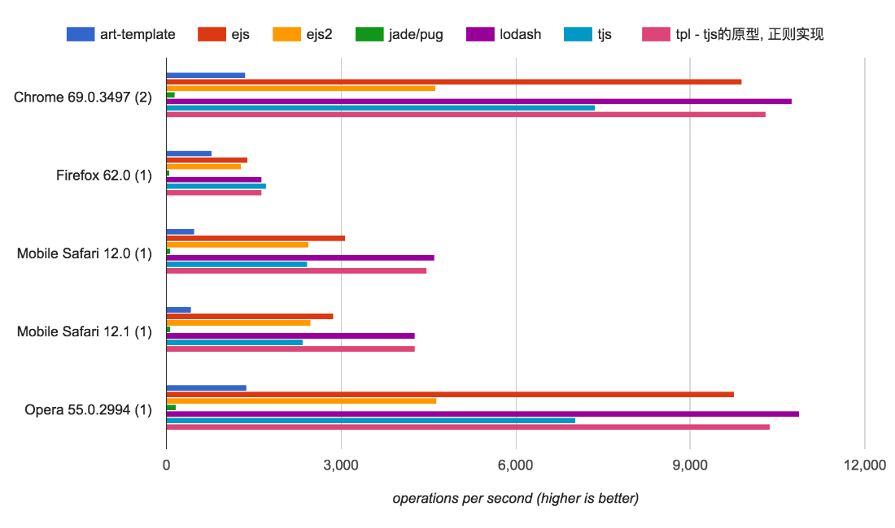

# tjs

模板引擎

[测试例子](https://flfwzgl.github.io/tjs/test)

[在线demo](https://demo.fanlinfeng.com/tjs---%E6%A8%A1%E6%9D%BF%E5%BC%95%E6%93%8E)

<p align="center">
  
</p>

### 特性
* 根据 **js** 视图逻辑生成html
* 支持自定义分隔符, 默认 `<%%>`
* `单引号/双引号/反引号/正则表达式` 中包含分隔符会自动识别并忽略, 例如 `<%var str = 'this is a <%test%>'%>` 😊
* 在保证 [__无错误__](https://flfwzgl.github.io/tjs/test/%E6%AD%A3%E5%88%99%E8%A1%A8%E8%BE%BE%E5%BC%8F.html) 的情况下具有很高的转换性能
* 错误定位, 如下图 ⬇︎

<p align="center">
  
</p>


### 性能

这里使用 [__jsperf__](https://jsperf.com/template-engines-benchmark/18) 测试几个模板引擎的渲染分页器的性能

##### 测试说明:
1. `jade/pug` 因为语法特殊所以单独写了 `pugCode` 模板做测试.
2. `lodash` 中 `_.template` 方法对 `-` 和 `=` 的处理正好和 ejs 相反, 模板单独用的 `lodash-code`
3. tpl 是用正则实现的 tjs 的原始版本, 具有极高的性能. tpl 和 `ejs/ejs2/art-template/lodash` 一样的问题在于: 没有对模板中js逻辑中的 `引号/注释/正则` 做特殊处理, 一旦其中包含分隔符如 `<% %>`, 则会直接导致渲染错误. 例如 `<%='hello%>' + name%>abc`,  `<%var reg = /\w+%>/%>123`, `<%/*<%comment%>*/%>def`
4. tjs 通过自创奇淫技巧对语法进行特殊识别, 可有效跳过 第3点 中的问题, 性能虽有所下降(不低于ejs2), 但保证模板 __无差错__ 渲染.

测试结果如图所示 ⬇︎
<p align="center">
  <a href="https://jsperf.com/template-engines-benchmark/18" target="_blank">
    
  </a>
</p>


### 安装
``` bash
$ npm i node-tjs
```
或者直接引入
``` html
<script src="https://flfwzgl.github.io/tjs/lib/tjs.min.js"></script>
```

### 例子

模板 tpl
``` html
<%list.forEach(function (item, i) {%>
  <div><%=item%></div>
<%})%>
```

使用
``` javascript
var render = tjs(tpl);

render({
  list: ['Tom', 'Lucy', 'Jack']
})
```

输出
``` html
  <div>Tom</div>

  <div>Lucy</div>

  <div>Jack</div>
```

### 许可
MIT


---


# tjs

html template engine

[test examples](https://flfwzgl.github.io/tjs/test)

[demo](https://demo.fanlinfeng.com/tjs---%E6%A8%A1%E6%9D%BF%E5%BC%95%E6%93%8E)

# Fetures
* generate html with javascript logic
* customizable separator, default `<%%>`
* separator in `single quote/double quote/backquote/regular expression` can be recognized automatically, such as `<%var str = 'this is a <%test%>'%>` 😊

# Installation
``` bash
npm i node-tjs
```
or include directly
``` javascript
<script src="https://flfwzgl.github.io/tjs/lib/tjs.min.js"></script>
```


# Example
template save as tpl
``` html
<%list.forEach(function (item, i) {%>
  <div><%=item%></div>
<%})%>
```

invoke
``` javascript
var render = tjs(tpl);

render({
  list: ['Tom', 'Lucy', 'Jack']
})
```

output
``` html
  <div>Tom</div>

  <div>Lucy</div>

  <div>Jack</div>
```

### LICENSE
MIT


