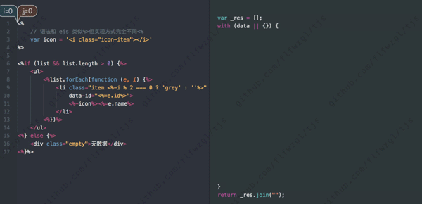

# tjs

模板引擎


[在线demo](https://demo.fanlinfeng.com/tjs---%E6%A8%A1%E6%9D%BF%E5%BC%95%E6%93%8E)

[测试例子](https://flfwzgl.github.io/tjs/test)

<p align="center">
  
</p>

### 特性
* 根据 **js** 视图逻辑生成html
* 支持自定义分隔符, 默认 `<%%>`
* `单引号/双引号/反引号/正则表达式` 中包含分隔符会自动识别并忽略, 例如 `<%var str = 'this is a <%test%>'%>` 😊

### 安装
``` bash
$ npm i node-tjs
```
或者直接引入
``` html
<script src="tjs.min.js"></script>
```

### 例子

模板 tpl
``` html
<%list.forEach(function (item, i) {%>
  <div><%=item%></div>
<%})%>
```

使用
``` javascript
var render = tjs(tpl);

render({
  list: ['Tom', 'Lucy', 'Jack']
})
```

输出
``` html
  <div>Tom</div>

  <div>Lucy</div>

  <div>Jack</div>
```

### 许可
MIT


---


# tjs

html template engine

[demo](https://demo.fanlinfeng.com/tjs---%E6%A8%A1%E6%9D%BF%E5%BC%95%E6%93%8E)

[test examples](https://flfwzgl.github.io/tjs/test)


# Fetures
* generate html with javascript logic
* customizable separator, default `<%%>`
* separator in `single quote/double quote/backquote/regular expression` can be recognized automatically, such as `<%var str = 'this is a <%test%>'%>` 😊

# Installation
``` bash
npm i node-tjs
```
or include directly
``` javascript
<script src="tjs.min.js"></script>
```


# Example
template save as tpl
``` html
<%list.forEach(function (item, i) {%>
  <div><%=item%></div>
<%})%>
```

invoke
``` javascript
var render = tjs(tpl);

render({
  list: ['Tom', 'Lucy', 'Jack']
})
```

output
``` html
  <div>Tom</div>

  <div>Lucy</div>

  <div>Jack</div>
```

### LICENSE
MIT


